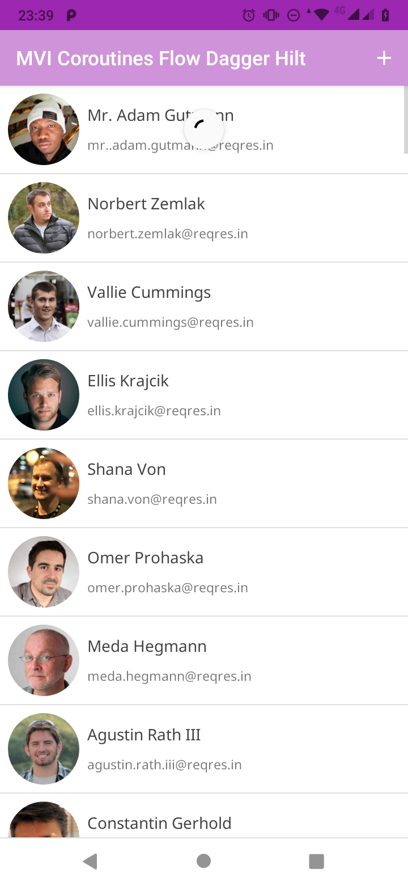
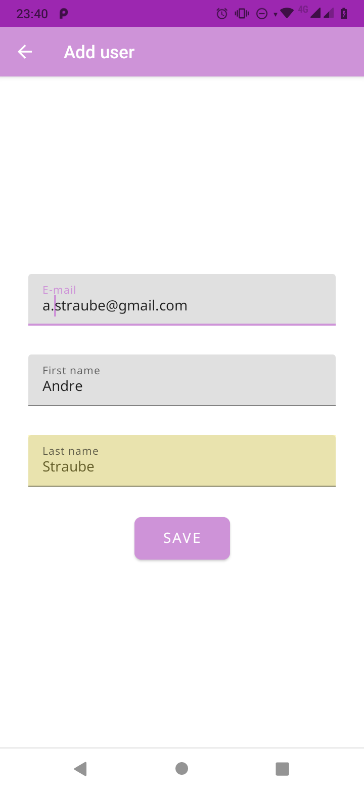
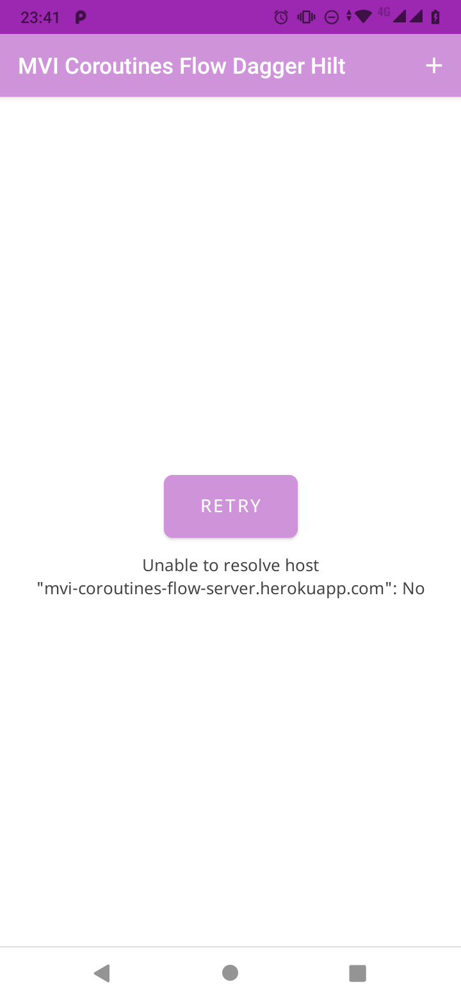

# MVI-Coroutines-Flow

## Coroutine + Flow = MVI :heart:
*   Play MVI with Kotlin Coroutines Flow
*   Master branch using Dagger Hilt for DI
*   Example Dark theme
*   Unit test to Kotlin Flow in `'src/test/java/com.straucorp.mviflow/FlowUnitTest.kt'`
*   **[Download apk here](https://github.com/astraube/MVI-Coroutines-Flow-Dagger-Hilt/raw/master/app/build/outputs/apk/debug/app-debug.apk)**

| List view state | Error view state | Add new user |
| --------------- | ---------------- | ------------ |
|  |  |  |

