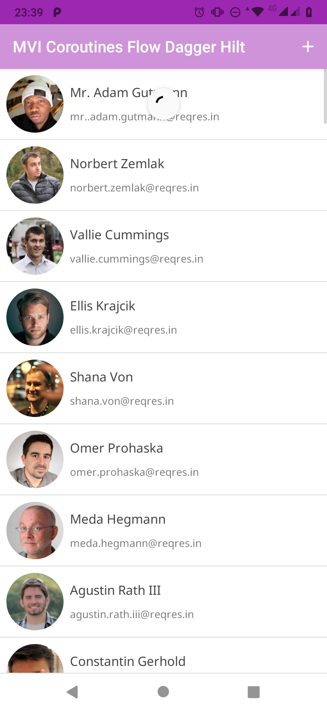
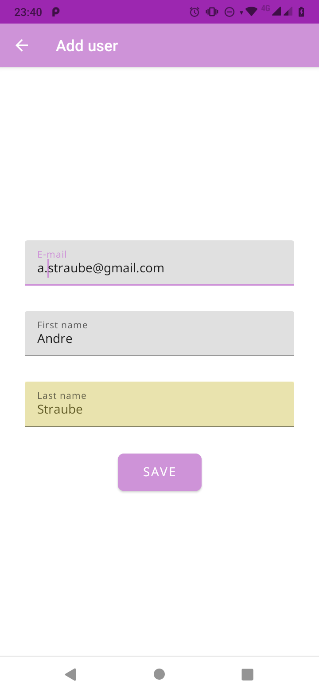
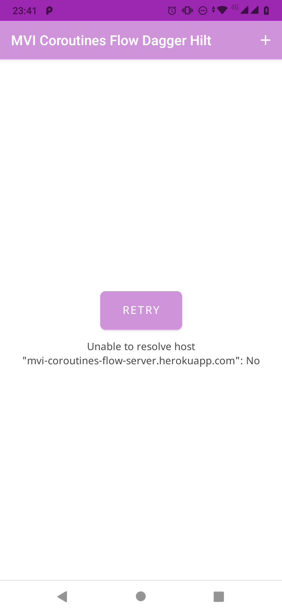

# MVI Coroutines Flow Dagger Hilt

## Coroutine + Flow = MVI :heart:
*   Play MVI with Kotlin Coroutines Flow
*   Master branch using Dagger Hilt for DI
*   Example Dark theme
*   [Unit test to Kotlin Flow](https://github.com/astraube/MVI-Coroutines-Flow-Dagger-Hilt/blob/master/app/src/test/java/com/straucorp/mviflow/FlowUnitTest.kt)
*   **[Download release apk here](https://github.com/astraube/MVI-Coroutines-Flow-Dagger-Hilt/raw/master/app/release/app-release.apk)**

| List view state | Error view state | Add new user |
| --------------- | ---------------- | ------------ |
|  |  |  |

